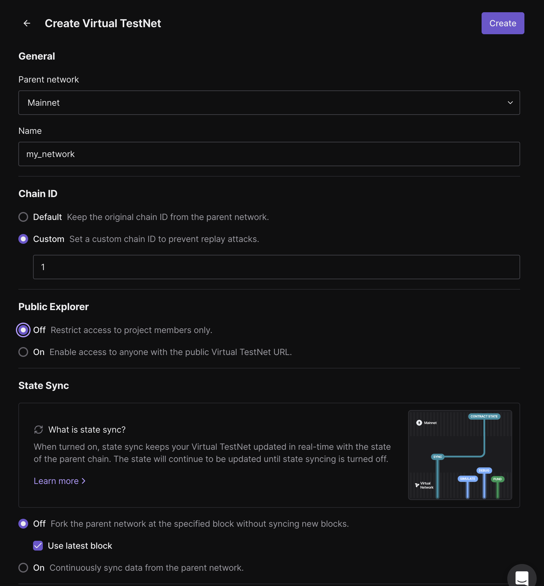
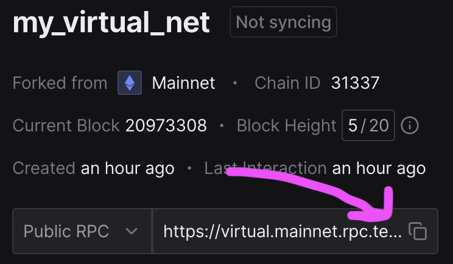

# web3py Favorites

This is from the [Cyfrin Updraft Vyper Course]().

- [web3py Favorites](#web3py-favorites)
- [Getting Started](#getting-started)
  - [Prerequisites](#prerequisites)
    - [Optional prerequisites](#optional-prerequisites)
  - [Installation](#installation)
    - [uv](#uv)
    - [pip/python](#pippython)
  - [Quickstart](#quickstart)
- [Deploying with Python](#deploying-with-python)
  - [1. Setup Tenderly Virtual Network](#1-setup-tenderly-virtual-network)
  - [2. Fund a wallet](#2-fund-a-wallet)
  - [3. Get your RPC URL](#3-get-your-rpc-url)
  - [The Unsafe Way](#the-unsafe-way)
    - [4. Run the unsafe version](#4-run-the-unsafe-version)
  - [The Safer Way](#the-safer-way)
  - [4. Encrypt your private key](#4-encrypt-your-private-key)
    - [5. Run the safe version](#5-run-the-safe-version)
- [Maintainer notes](#maintainer-notes)
  - [Build a new requirements.txt](#build-a-new-requirementstxt)


# Getting Started

## Prerequisites

- [uv](https://docs.astral.sh/uv/)
  - You'll know you've done it right if you can run `uv --version` and see a version number.
- [git](https://git-scm.com/)
  - You'll know you've done it right if you can run `git --version` and see a version number.

### Optional prerequisites

If you're an advanced python user, you can use virtual environments and classic python/pip to work here.

- [python](https://www.python.org/)
- [pip](https://pypi.org/project/pip/)

## Installation

```bash
git clone https://github.com/cyfrin/web3py-favorites-cu
cd web3py-favorites-cu
```

### uv 

```bash
uv sync
```

### pip/python

```bash
python -m venv ./venv
source ./venv/bin/activate
pip install -r requirements.txt
```

## Quickstart

```bash
uv run hello.py # for UV
# or
python hello.py # for pip/python
```

# Deploying with Python

## 1. Setup Tenderly Virtual Network

Go to [tenderly](https://dashboard.tenderly.co/) and sign up, and then select `Create Virtual TestNet`.


Your config should look like this:



## 2. Fund a wallet

Select your network, and hit `Fund Account` and paste in an address.

We recommend using `0xf39Fd6e51aad88F6F4ce6aB8827279cffFb92266` since it's a well-known testing address. 


## 3. Get your RPC URL

Create a `.env` file, get your RPC URL from the tenderly dashboard, and add it to your `.env` file.



Example `.env`:

```bash
RPC_URL=https://asdfasdfs
```

## The Unsafe Way

### 4. Run the unsafe version

Add your private key to your `.env` file. This should be the private key associated with the account you funded. If you used the address above, use the following:

_example `.env`_
```bash
RPC_URL="your_rpc_url"

# NEVER DO THIS WITH A REAL KEY!!!
PRIVATE_KEY="0xac0974bec39a17e36ba4a6b4d238ff944bacb478cbed5efcae784d7bf4f2ff80"
MY_ADDRESS="0xf39Fd6e51aad88F6F4ce6aB8827279cffFb92266"
```

This is OK since the address and private key are well known testing keys.

Then, you can run:

```bash
uv run deploy_favorites_unsafe.py # uv
# or
python deploy_favorites_unsafe.py # pip/python
```

And you'll deploy the contract!

## The Safer Way

## 4. Encrypt your private key

We want you to practice not having your private key in plain text! So run the following:

```bash
uv run encrypt_key.py # uv 
# or
python encrypt_key.py # pip/python
```

This will prompt you for a password and private key. We recommend using the following:

```
0xac0974bec39a17e36ba4a6b4d238ff944bacb478cbed5efcae784d7bf4f2ff80
```

Since this is a well-known testing key, feel free to use an easy password - TYPICALLY YOU SHOULD NEVER SHARE YOUR PRIVATE KEY.

### 5. Run the safe version

```bash
uv run deploy_favorites.py # uv
# or
python deploy_favorites.py # pip/python
```

This will prompt you for a password to decrypt, and then you'll deploy your contract without exposing your private key! Huzzah!

# Maintainer notes

If you're a student, ignore this section!

## Build a new requirements.txt

```bash
uv pip compile pyproject.toml -o requirements.txt
```